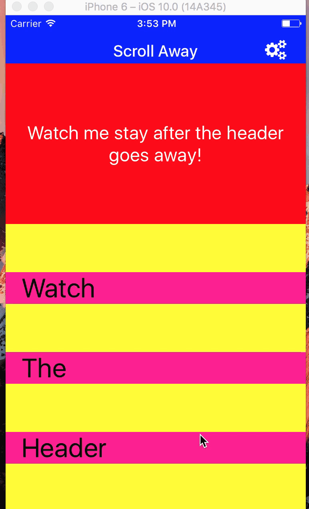

# RN-Header

### Can Use the header as a stand alone header, or a scroll away header.

#### You must have `react-native-vector-icons` installed and linked for this to work


### Uses Font Awesome icons as the icon source
```js
npm install react-native-vector-icons --save
react-native link react-native-vector-icons
npm install rn-header --save

```
- To use as a scroll away header takes a little work to set up.
- import `Animated` from react-native
- Add an Animated.Value to the component state.  Need a `scrollY` so the Header can respond properly
- Can use with Listview or ScrollView.
- SET UP THE ONSCROLL PROP TO MATCH THIS EXAMPLE
- If you don't `use scrollEventThrottle` you're gonna have a bad time...mmmm-kay??
- just copy/paste this example and you'll get the hang of it 🤓
- When using as a scroll away header, wrap whatever content you want to stay within the `<Header>  </Header>` tags.  When using as a stand alone Header, just use as `<Header/>`


####  If you do not want the header to scroll away,  do not supply the header with the `scrollY`




```js
'use strict'

import React, { Component } from 'react';
import {
View,
Text,
ScrollView,
Animated
} from 'react-native';

import Header from 'rn-header';


export default class Example extends Component {
 constructor(props){
   super(props);
   this.scrollListener = this.scrollListener.bind(this);
   this.state = {
     scrollY: new Animated.Value(0),
   };
 };


 render(){
   let things = ['Watch','The','Header','Scroll','Away','As','I','Move'].map((opt,i) => {
     return(
       <View
         key={i}
         style={{
           marginTop:60,
           backgroundColor:'deeppink',
           paddingLeft:20
         }}>
         <Text style={{fontSize:33}}>{opt}</Text>
       </View>
     )
   });
   return(
     <View style={{
       flex:1,
       backgroundColor:'yellow'
     }}>
       <Header
         scrollY={this.state.scrollY}
         backgroundColor={'blue'}
         height={60}
         text={'Scroll Away'}
         iconRightName={'cogs'}
         iconSize={25}
         iconColor={'white'}
         onRightIconPress={
           () => console.log('Stuff')
          }
         textStyle={{
           fontSize:20,
           color:'white',
           fontWeight:'500'
         }}>

         <View style={{
           height:200,
           backgroundColor:'red',
           alignItems:'center',
           justifyContent:'center'
         }}>
           <Text style={{
             color:'white',
             fontSize:23,
             textAlign: 'center'
           }}>Watch me stay after the header goes away!</Text>
         </View>
       </Header>

       <ScrollView
         scrollEventThrottle={16}//without this it will be choppy as fuck
         onScroll={
           Animated.event(
           [{nativeEvent: {contentOffset: {y:  this.state.scrollY }}}]
           )
         }

         {things}
       </ScrollView>
     </View>
   )
 };

};
```

### All props
| Prop  |  Type  | Description |
| ---   | ---    | ---         |
| backgroundColor | string (Required) | backgroundColor of the Header                     |
| height          | number (Required) | height of the Header                              |
| text            | string            | centered text of Header                           |  
| iconLeftName    | string or bool    | name of Font Awesome Icon for left side of Header |
| onLeftIconPress | function          | function called on press of left icon             |
| iconRightName   | string or bool    | name of Font Awesome Icon for right side of Header|  
| onRightIconPress| function          | function called on press of right icon            |
| thirdIconName   | string or bool    | name of Font Awesome Icon for third icon of Header|
| onThirdIconPress| function          | function called on press of third icon            |
| textStyle       | object            | styles applied to the Header's text               |  
| iconSize        | number            | size of the icon(s) on the Header                 |
| iconColor       | string            | color of the Header's icon(s)                     |
| scrollY         | Animated Value    | for the Header to scroll away, it needs a reference to the scrollY position of the scrollable content|  


