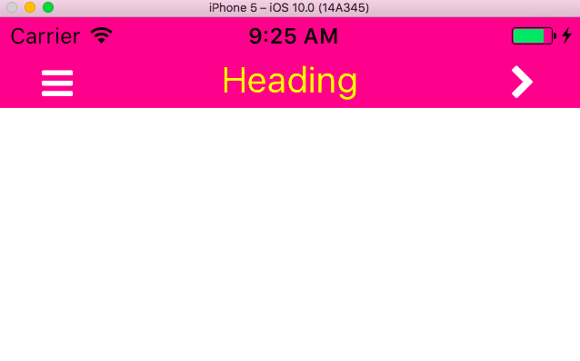
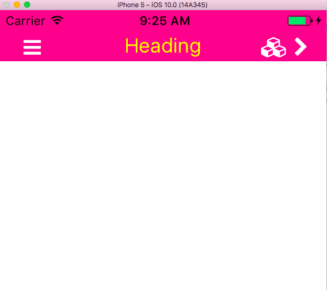

# RN-Header
<br>
#### You must have `react-native-vector-icons` installed and linked for this to work
<br>
### Uses Font Awesome icons as the icon source
* `npm install react-native-vector-icons --save`
* `react-native link react-native-vector-icons`
* `npm install rn-header --save`



```js
import React, { Component } from 'react';

import Header from 'rn-header';

class HeaderTwoIcons extends Component {
  render(){
    return(
      <Header
        backgroundColor={'deeppink'}
        height={50}
        text={'Heading'}
        iconLeftName={'bars'}
        onLeftIconPress={
          () => console.log('Do Stuff')
        }
        iconRightName={'chevron-right'}
        onRightIconPress={
          () => console.log('Do other stuff')
        }
        // pass in false or just omit the prop
        thirdIconName={false}
        textStyle={{
          color:'yellow',
          fontSize:20
        }}
        iconSize={20}
        iconColor={'white'}
      />
    )
  };

class HeaderThreeIcons extends Component {
  render(){
    return(
      <Header
        backgroundColor={'deeppink'}
        height={50}
        text={'Heading'}
        iconLeftName={'bars'}
        onLeftIconPress={
          () => console.log('Do Stuff')
        }
        iconRightName={'chevron-right'}
        onRightIconPress={
          () => console.log('Do other stuff')
        }
        thirdIconName={'cubes'}
        onThirdIconPress={
          () => console.log('Do other other stuff')
        }
        textStyle={{
          color:'yellow',
          fontSize:20
        }}
        iconSize={20}
        iconColor={'white'}
      />
    )
    };

}
```


